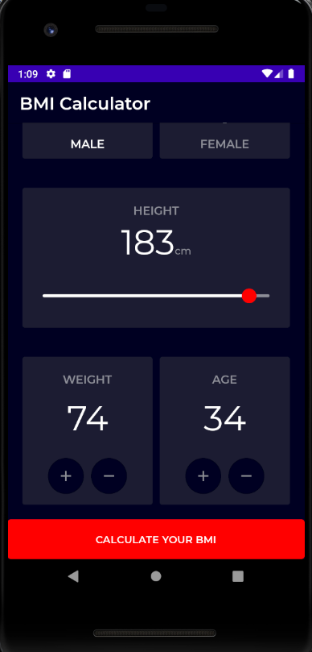
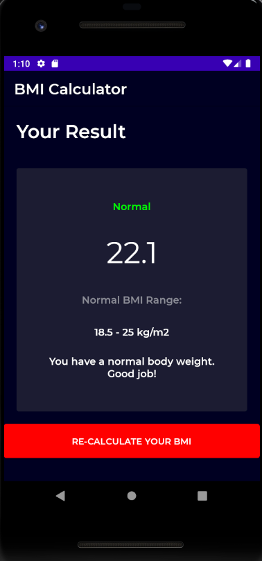

# BMI Calculator
BMI Calculator is a simple app, built with
[Jetpack Compose](https://developer.android.com/jetpack/compose). The goal of the sample is to
showcase the current UI capabilities of Compose.

Screenshots
-----------
   

## Features

This sample contains two screens: a page to enter values of weight, height, age and gender, a result page for showing BMI.

### App scaffolding

Package [`com.makazemi.calculatorBMI.ui`][1]

[`BMICalculatorNavGraph.kt`][2] configures the navigation routes and actions in the app. 

[1]: app/src/main/java/com/makazemi/calculatorBMI/ui
[2]: app/src/main/java/com/makazemi/calculatorBMI/ui/BMICalculatorNavGraph.kt

